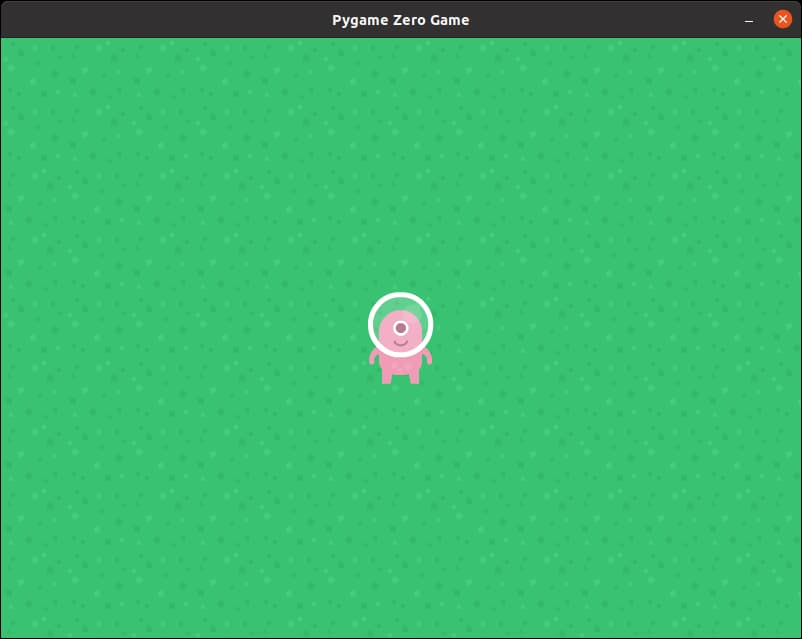

# Player

Next, we're going to add our player. Just like the background, we'll start by creating an **Actor** using the image file.

```python
player = Actor('p3_front')
```

*If you are using a different image, change the **p3_front** to your image file name.*

I'll like the player to start in the middle of the screen, so below the previous line, let's add the starting x and y position.

```python
player.x = 400
player.y = 300
```

*The width and height of the game window is 800 and 600, so to place our player in the middle, we set the **x** to half the width and the **y** to half the height*

We'll also need to draw the player, so we'll need to add...

```python
player.draw()
```

**IMPORTANT!** Be sure to put this inside the **draw()** function.

**IMPORTANT!** The ```player.draw()``` must come after the ```background.draw()```. What will happen if you draw the background after the player?

## At this point...

Right now your code should look like this (new lines are highlighted in yellow)...

```python hl_lines="8 9 10 14"
import pgzrun

WIDTH = 800
HEIGHT = 600

background = Actor('grass')

player = Actor('p3_front')
player.x = 400
player.y = 300

def draw():
    background.draw()
    player.draw()

pgzrun.go() # Must be last line
```

Your game should now look like this...

