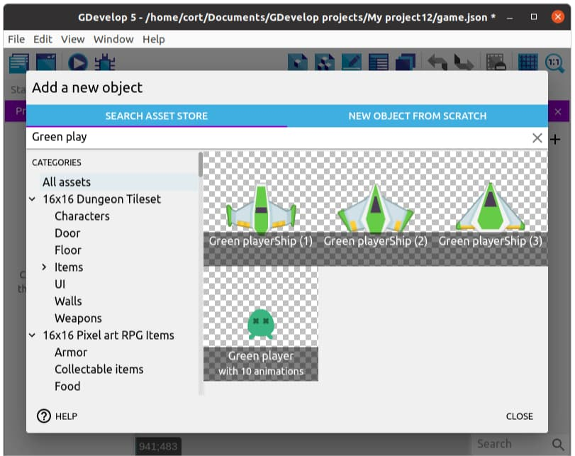

# First Object

Click on **Add new object**, then from the asset store search for the **Green Player** and add it to the game.

If you can't find the **Green Player** object, make sure **All assets** is selected, then type in "green player" into the search bar.

**Important** There's nothing special about the Green Player object.
I like it as it has a lot of useful animations that I can make use of and I like the color green.
If you prefer a different character or have a different favorite color (heathen!), feel free to choose whatever you want.

Once done, you can close the **Add new object** window.

## Creating an Instance

Now you have your first object, but notice that it's not in the game scene yet.
To add the object to your scene, drag it from the objects panel to the scene.
We call this **creating an Instance**.

Each object can have many instances, and every instance can have a different set of properties (eg. position, size, angle).

## Adding Behaviors

One powerful feature of GDevelop, is the ability to easily add **Behaviors** to an object, enhancing it with useful features.
Many of the features used in games are already available as behaviors, allowing us to save a lot of coding.

To start, double click on the player object, switch to the **Behaviors** tab, and click **Add a Behavior to the object**.

We'll be adding two behaviors...

* Top-down movement
* Stay on Screen

The **Top-down movement** behavior is installed by default, so you can just click to add it.
This behavior allows us to move the player using the arrow keys, and after adding it, you can tune the parameters (eg. speed and acceleration).
For now, just make sure the **Rotate object** option is disabled, and leave the rest of the settings alone (...or mess around with it. Experimentation is cool.).

The **Stay on Scene** behavior will prevent your player from leaving the screen and is not installed by default.
Search for it under **Search new behaviors** and install it in the project.
Once that is done, you can add it to your object by clicking on it under **Installed behaviors**.
Set the **bottom margin** and **right margin** to **20**.