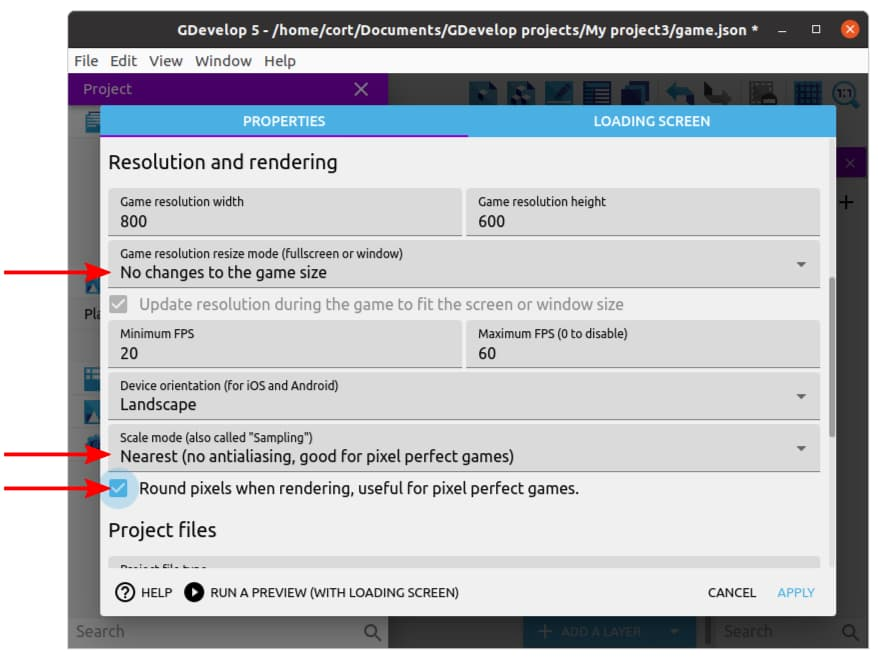

# Getting Started

As before, start by opening up GDevelop. If you're using the web-based editor, use this link [editor.gdevelop-app.com](https://editor.gdevelop-app.com).

Create a new **Empty Game**, add a scene, and name the scene **Play**.
As before, there's nothing special about the scene name, so use whatever you want.

Open up the scene, and you should be greeted with the scene editor...

## Project Properties

For this game, we'll be aiming for a retro pixel art aesthetics, to achieve that, we'll need to change a few settings.
Open up the **Project Properties** window...

...and set...

* **Game resolution resize mode** to **No changes to the game size**
* **Scale mode** to **Nearest**
* **Round pixels when rendering** to **Checked**

These settings helps to preserve the jagged, pixelated look of the image.
Without them, GDevelop will smooth jagged edges, making them look blurry.

## Scenes

We'll start with just one scene for now, but eventually, we'll have 4 scenes in total:

### Play Scene

This is where we will have the main gameplay.
It will comprise of a large map with...

* Walls and other obstacles
* Two Non-Player Characters (NPC)
* A few enemies
* An item to pickup
* Player character

### Start Scene

Just as in **Dodge the Creep**, we'll have a start screen for the game.
Basically just a title and a clickable button to start the game.

### Game Over Scene

We'll use this scene when the player loses.
It'll just display a "game over" message and provide a button to restart the game.

## Win Scene

This is used when the player completes the game.
Traditionally, this is where we will display credits for the game.
We'll also provide a button to restart the game after the credits.