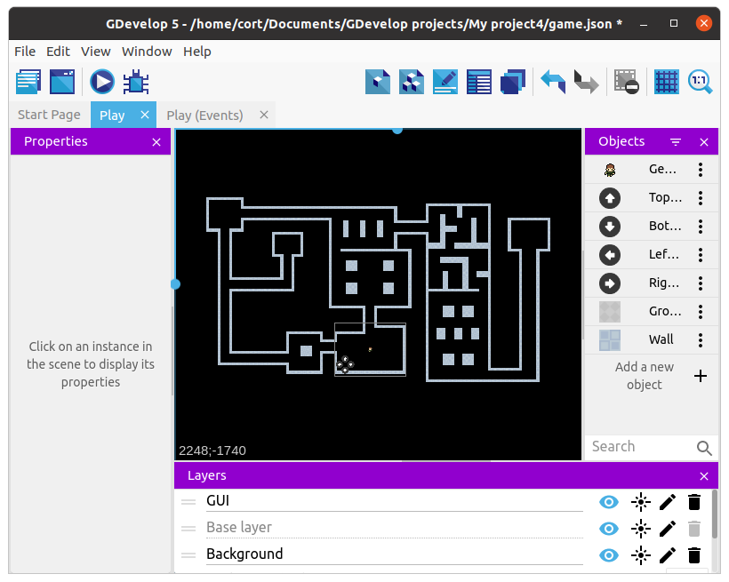
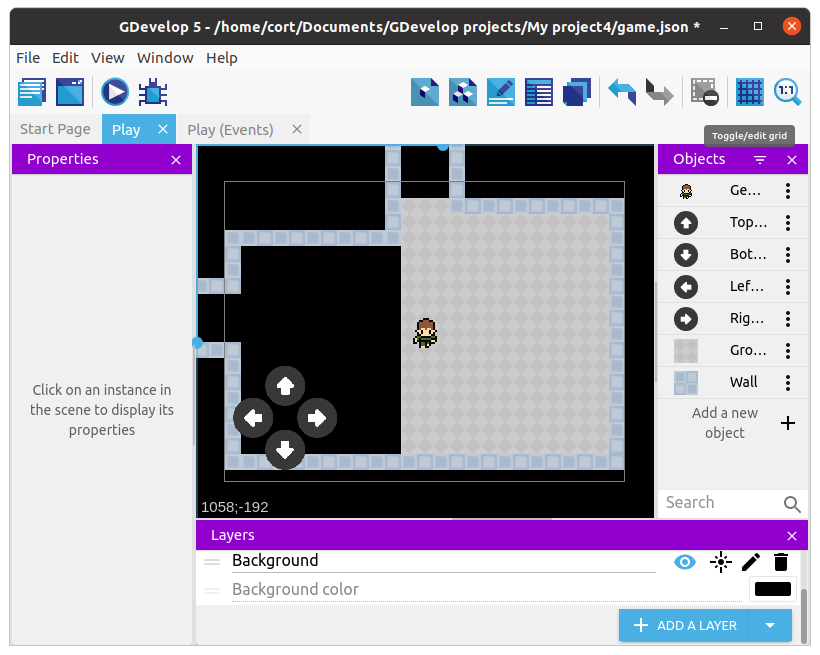
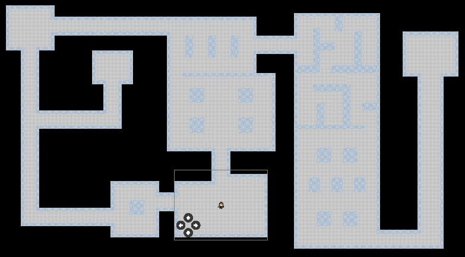

# Game World

First, set the background color to **Black**.
This will make our walls and ground stand out more.
You can find the setting for the background color at the bottom of the **Layers** window.

Next, rename **Blue Background** to **Wall** (...not essential, but it makes things clearer), then drag it on to the scene.
Resize it and use it to build the first wall in the scene.
Repeat until you have a huge maze...

*Grid temporarily turned off for clarity*

Next, rename **Gray Background** to **Ground**, and drag it on to the scene.
Change its layer to **Background**, and position it within the interior areas of the maze like this...

Repeat until all the interior areas of the maze are filled with ground.

Changing the layer for all the ground sprites can be quite a pain.
One shortcut is to change the layer for the first ground sprite, then copy-and-paste it.

## Wall Collision

If you test the game now, your player will be able to move right through the walls.
To prevent that, we'll need to add a new event.

Select the **Player Movement** group event and add a new sub-event.
For the condition, choose the player, then **Collision**, and set the object to **Wall**.
For the action, choose the player, then **Separate objects**, and set the object to **Wall**.

## Camera

Great!
Now you can't move through walls, but you can't go very far either without leaving the screen.

To keep our player on screen, we need to make the camera follow the player as they move.
Select the **Player Movement** group event again and add another new sub-event.

We don't need a condition for this, as we want the camera to always follow the player.
For the actions, select **Other Actions**, **Layers and Cameras**, and **Center the camera on an object**.
For the object, select the player, and for the layer, you can leave it blank for now.

Now, add a second action below the first.
Make the second action the same as the first, but this time, set the layer to **"Background"**.

Go ahead and test out your game.
You should be able to move around the world without going through walls.